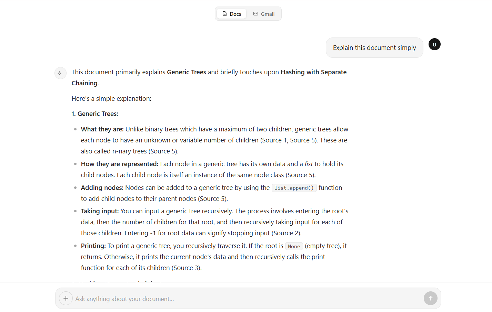
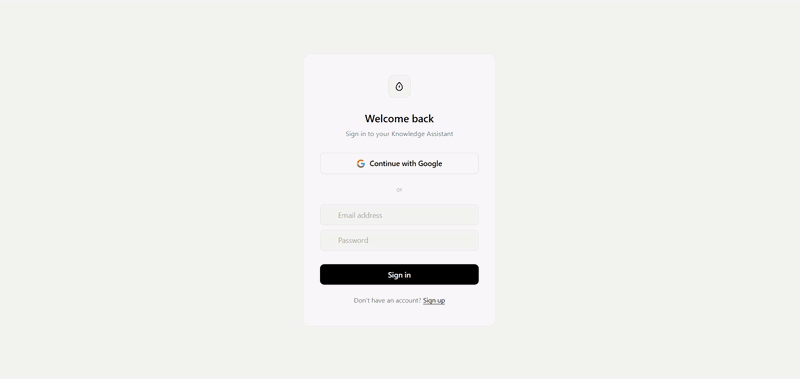
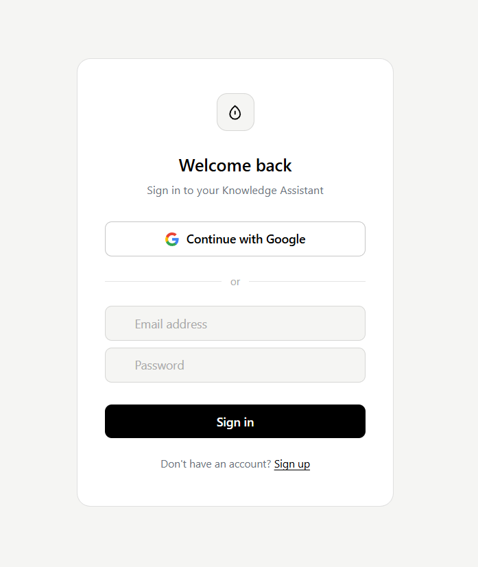
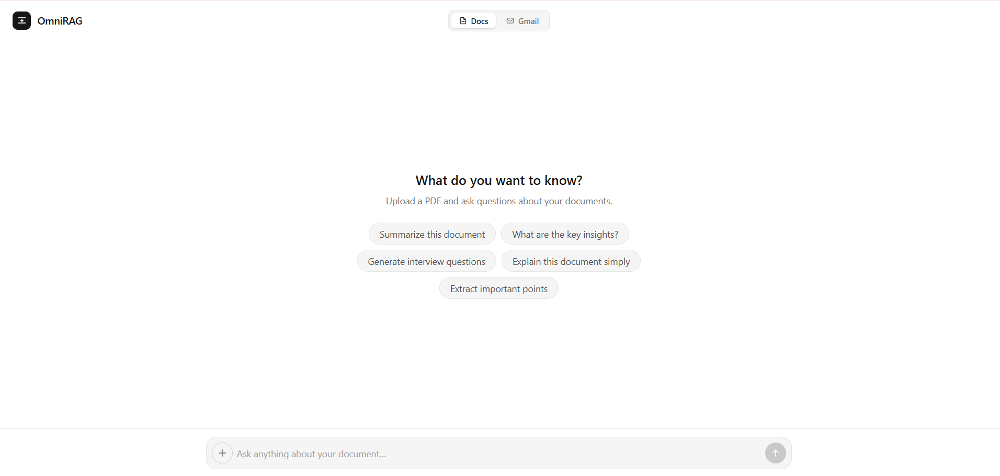
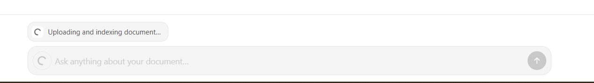
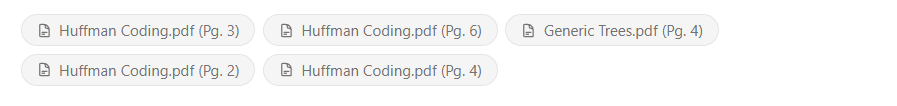
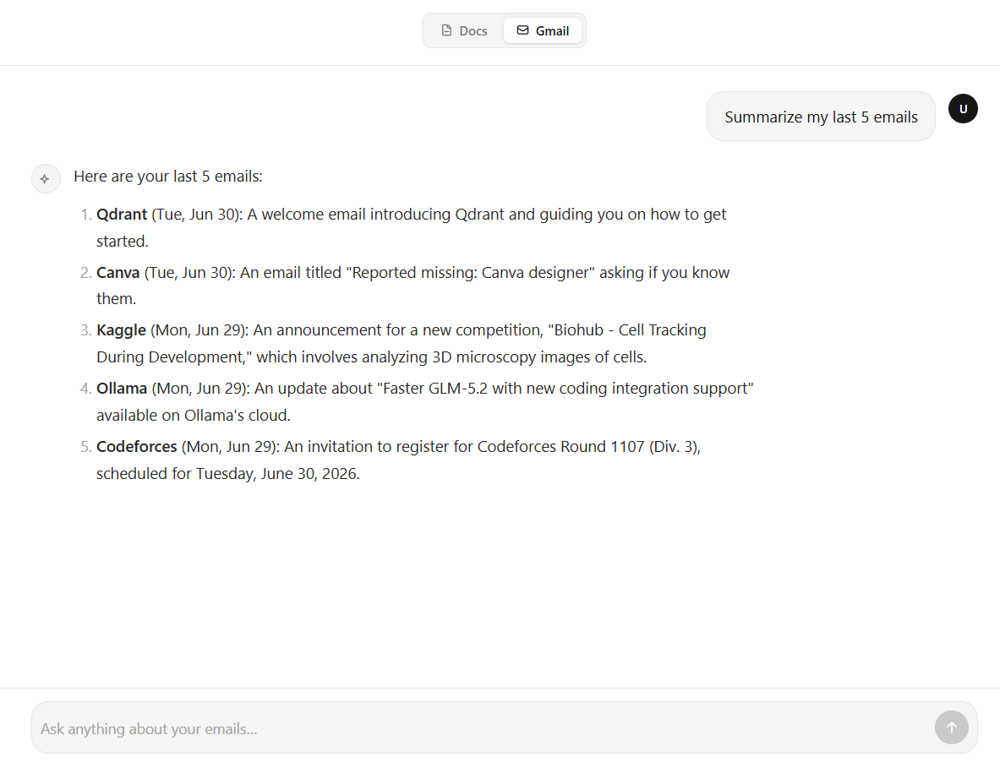
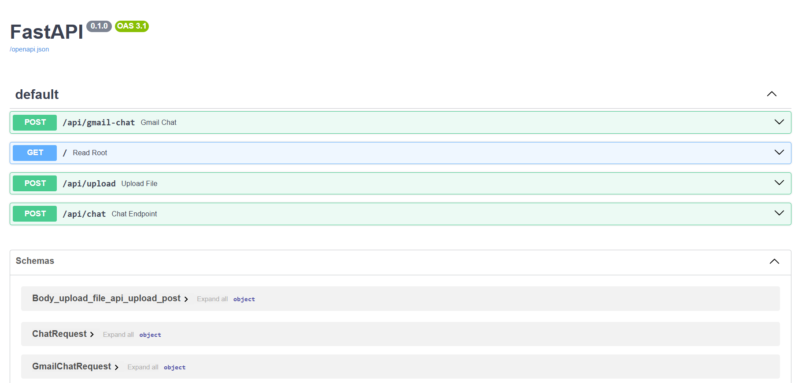

<div align="center">

#  OmniRAG

### Multi-Source AI Knowledge Assistant

*Upload PDFs, connect Gmail, and chat with your own private, isolated knowledge base — powered by Gemini.*

[](https://www.python.org/)
[](https://fastapi.tiangolo.com/)
[](https://react.dev/)
[](https://www.typescriptlang.org/)
[](https://firebase.google.com/)
[](https://qdrant.tech/)
[](https://ai.google.dev/)
[](https://www.docker.com/)

</div>

<br/>

<div align="center">

<!--
🖼️ HERO SCREENSHOT — drag your main chat UI screenshot into docs/screenshots/ and update the path below
-->


<br/><br/>



</div>

<br/>

> **OmniRAG** lets every authenticated user build a **private, isolated knowledge base** from multiple sources — PDFs today, Gmail and learning platforms next — and chat with it in real time. Every user gets their own Qdrant vector collection (`kb_<uid>`), so nobody's documents, embeddings, or chat context ever leak across accounts.

<br/>

## 📑 Table of Contents

<table>
<tr>
<td valign="top" width="33%">

**Getting Started**
- [Features](#-features)
- [Tech Stack](#-tech-stack)
- [Architecture](#-architecture)
- [Prerequisites](#-prerequisites)

</td>
<td valign="top" width="33%">

**Setup & Run**
- [Environment Variables](#-environment-variables)
- [Setup](#-setup)
- [Running Locally](#-running-the-app-locally)
- [API Docs](#-fastapi-api-documentation)

</td>
<td valign="top" width="33%">

**Reference**
- [Useful Commands](#-useful-commands)
- [Project Structure](#-project-structure)
- [Walkthrough](#-walkthrough)
- [Security Notes](#-security-notes)
- [Roadmap](#-roadmap)

</td>
</tr>
</table>

<br/>

## ✨ Features

| | |
|---|---|
| 🔐 | **Firebase Authentication** — Google Sign-In + email/password, verified server-side on every request |
| 🗂️ | **Multi-Tenant Vector Isolation** — each user gets a dedicated Qdrant collection (`kb_<uid>`) |
| 📄 | **PDF Knowledge Base** — extraction, cleaning, chunking, embedding, and indexing fully automated on upload |
| 📬 | **Gmail Knowledge Integration** — connect Gmail content and query it like any other source |
| 🎓 | **Learning-Platform Ready** — architecture extends to course notes, docs, and LMS content |
| ⚡ | **Streaming Chat (SSE)** — real-time token streaming, no waiting for the full response |
| 📎 | **Source Citations** — every answer links back to its file, page, or email |
| 🧪 | **Swagger UI Built-In** — test every endpoint at `/docs` without touching the frontend |

<br/>

## 🛠 Tech Stack

<div align="center">

| Layer | Technology |
|:---|:---|
| **Frontend** | React · TypeScript · Vite · Tailwind CSS |
| **Backend** | FastAPI · Python |
| **Auth** | Firebase Authentication · Firebase Admin SDK |
| **External Sources** | PDF Uploads · Gmail · Learning Platform Content |
| **Vector DB** | Qdrant (local or Cloud) |
| **Embeddings** | Sentence-Transformers — `BAAI/bge-base-en-v1.5` |
| **LLM** | Google Gemini |
| **PDF Parsing** | PyMuPDF |
| **Streaming** | Server-Sent Events |
| **Containerization** | Docker · Docker Compose |

</div>

<br/>

## 🏗 Architecture

```text
┌──────────────────┐       Firebase ID Token        ┌──────────────────┐
│                  │ ─────────────────────────────► │                  │
│  React Frontend  │                                 │  FastAPI Backend │
│                  │ ◄───────────────────────────── │                  │
└──────────────────┘        SSE Chat Stream          └────────┬─────────┘
                                                                │
                            ┌───────────────────────────────────┼───────────────────────────────────┐
                            │                                   │                                   │
                            ▼                                   ▼                                   ▼
               ┌──────────────────────┐           ┌──────────────────────┐           ┌──────────────────────┐
               │   Firebase Admin SDK │           │        Qdrant        │           │    Google Gemini     │
               │   Token Verification │           │  Per-user Collections │           │   RAG Response Gen   │
               └──────────────────────┘           └──────────────────────┘           └──────────────────────┘
                                                                ▲
                                                                │
                            ┌───────────────────────────────────┼───────────────────────────────────┐
                            │                                   │                                   │
                            ▼                                   ▼                                   ▼
                     ┌──────────────┐                   ┌──────────────┐                   ┌──────────────┐
                     │     PDFs     │                   │    Gmail     │                   │   Learning   │
                     │  Documents   │                   │   Content    │                   │   Sources    │
                     └──────────────┘                   └──────────────┘                   └──────────────┘
```

<details>
<summary><b>📥 Click to expand: Knowledge Ingestion Pipelines</b></summary>

<br/>

**PDF Ingestion**
```text
PDF Upload → Text Extraction (PyMuPDF) → Cleaning →
Chunking (overlap) → Embedding (bge-base-en-v1.5) →
Metadata Tagging (filename, page, source_type, uid) →
Upsert into kb_<uid>
```

**Gmail Ingestion**
```text
Google Sign-In → Fetch Gmail Content → Clean Body/Metadata →
Chunk → Embed → Tag (subject, sender, date, source_type, uid) →
Upsert into kb_<uid>
```

**Learning Platform Content**
```text
Source Material → Extraction → Clean & Chunk → Embed →
Tag (platform, source, uid) → Upsert into kb_<uid>
```

Retrieval at chat time is **always scoped to the logged-in user's own collection** — there is no cross-user fallback or shared index.

</details>

<br/>

## ✅ Prerequisites

- Python 3.11+
- Node.js 18+ and npm
- Docker
- A Firebase project with Authentication enabled
- A Google AI Studio API key (Gemini)
- Qdrant — local via Docker, or Qdrant Cloud

<br/>

## 🔑 Environment Variables

<details>
<summary><b>Backend — <code>backend/.env</code></b></summary>

```env
GOOGLE_API_KEY=your_gemini_api_key
FIREBASE_SERVICE_ACCOUNT_PATH=./firebase-service-account.json

QDRANT_URL=http://localhost:6333
QDRANT_API_KEY=
```

For Qdrant Cloud:
```env
QDRANT_URL=https://your-qdrant-cloud-url
QDRANT_API_KEY=your_qdrant_api_key
```

Download the service account key from **Firebase Console → Project Settings → Service Accounts → Generate new private key**, and place it in `backend/` as `firebase-service-account.json`.

</details>

<details>
<summary><b>Frontend — <code>frontend/.env.local</code></b></summary>

```env
VITE_FIREBASE_API_KEY=your_firebase_api_key
VITE_FIREBASE_AUTH_DOMAIN=your_project.firebaseapp.com
VITE_FIREBASE_PROJECT_ID=your_project_id
VITE_FIREBASE_STORAGE_BUCKET=your_project.appspot.com
VITE_FIREBASE_MESSAGING_SENDER_ID=your_sender_id
VITE_FIREBASE_APP_ID=your_app_id

VITE_API_BASE_URL=http://localhost:8080
```

For production, create `frontend/.env.production`:
```env
VITE_API_BASE_URL=https://your-backend-url.com
```

</details>

> ⚠️ **Never commit `.env`, `.env.local`, `.env.production`, or `firebase-service-account.json`.** Commit `.env.example` placeholders instead — see [Recommended `.gitignore`](#-recommended-gitignore).

<br/>

## 🚀 Setup

```powershell
# 1. Clone
git clone <your-repo-url>
cd "AI Knowledge Assistance guide"

# 2. Backend
cd backend
python -m venv venv
.\venv\Scripts\Activate
pip install -r requirements.txt

# 3. Frontend
cd ../frontend
npm install
```

<br/>

## ▶️ Running the App Locally

**1 · Start Qdrant** (skip if using Qdrant Cloud)
```powershell
cd backend
docker-compose up -d
```

**2 · Start the Backend**
```powershell
.\venv\Scripts\Activate
uvicorn main:app --host 0.0.0.0 --port 8080 --reload
```
→ Backend live at `http://localhost:8080`

**3 · Start the Frontend**
```powershell
cd frontend
npm run dev
```
→ Frontend live at `http://localhost:5173`

Make sure `VITE_API_BASE_URL` in your frontend env points to the backend URL above.

<br/>

## 📘 FastAPI API Documentation

Once the backend is running, open:

```
http://localhost:8080/docs
```

Interactive Swagger UI — test `/api/upload`, `/api/chat`, and Gmail routes directly from the browser, inspect request/response schemas, and debug without touching the frontend.

<br/>

## 💻 Useful Commands

<details>
<summary><b>🔄 Rebuild Backend Virtual Environment</b></summary>

```powershell
cd backend
deactivate
Remove-Item -Recurse -Force venv
python -m venv venv
.\venv\Scripts\Activate
pip install -r requirements.txt
```
</details>

<details>
<summary><b>📦 Install Common Frontend Packages</b></summary>

```powershell
npm install firebase
npm install react-markdown
npm install react-syntax-highlighter
npm install tailwindcss @tailwindcss/postcss postcss
npm install -D @types/react-syntax-highlighter
```
</details>

<details>
<summary><b>📦 Install Backend Package Manually</b></summary>

```powershell
pip install firebase-admin
```
</details>

<details>
<summary><b>🗄️ Qdrant Collection Management</b></summary>

List all collections:
```powershell
Invoke-RestMethod -Uri "http://localhost:6333/collections"
```

Inspect a user's collection:
```powershell
Invoke-RestMethod -Uri "http://localhost:6333/collections/kb_<uid>"
```

View sample points:
```powershell
Invoke-RestMethod -Uri "http://localhost:6333/collections/kb_<uid>/points/scroll" `
  -Method POST -ContentType "application/json" `
  -Body '{"limit": 5, "with_payload": true}'
```

Delete a user's collection:
```powershell
Invoke-RestMethod -Uri "http://localhost:6333/collections/kb_<uid>" -Method DELETE
```

Delete the legacy shared collection:
```powershell
Invoke-RestMethod -Uri "http://localhost:6333/collections/knowledge_base" -Method DELETE
```

> ⚠️ If the embedding model changes (e.g. dimension changes from 384 → 768), **all existing collections must be deleted and documents re-ingested** — Qdrant locks each collection to a fixed vector dimension at creation time.

</details>

<br/>

## 🗃 Project Structure

```text
AI Knowledge Assistance guide/
│
├── backend/
│   ├── routers/
│   │   └── gmail.py               # Gmail OAuth + ingestion routes
│   ├── auth.py                    # Firebase token verification + collection naming
│   ├── check_db.py                # Qdrant inspection/debug script
│   ├── ingest.py                  # PDF ingestion pipeline
│   ├── main.py                    # FastAPI app, routes, lifespan setup
│   ├── docker-compose.yml         # Qdrant service definition
│   ├── Dockerfile                 # backend container build
│   ├── .dockerignore
│   ├── requirements.txt
│   ├── .env                       # gitignored
│   ├── firebase-service-account.json   # gitignored
│   ├── knowledge-archive/         # per-user uploaded PDFs, gitignored
│   └── venv/                      # gitignored
│
├── frontend/
│   ├── src/
│   │   ├── components/
│   │   │   ├── icons/
│   │   │   ├── EmptyState.tsx
│   │   │   ├── Header.tsx
│   │   │   ├── InputBar.tsx
│   │   │   ├── MessageBubble.tsx
│   │   │   ├── MessageContent.tsx
│   │   │   ├── MessageList.tsx
│   │   │   ├── RetryButton.tsx
│   │   │   └── ThinkingIndicator.tsx
│   │   ├── hooks/
│   │   │   ├── useChat.ts
│   │   │   ├── useGoogleAuth.ts
│   │   │   └── useIsDark.ts
│   │   ├── utils/
│   │   │   └── markdownComponents.tsx
│   │   ├── App.tsx
│   │   ├── App.css
│   │   ├── AuthPage.tsx
│   │   ├── firebase.ts
│   │   ├── main.tsx
│   │   └── useAuth.ts
│   ├── public/
│   ├── index.html
│   ├── eslint.config.js
│   ├── package.json
│   ├── .env / .env.local / .env.production   # gitignored
│   └── node_modules/               # gitignored
│
├── docs/
│   └── screenshots/                 # README images — login, chat, demo.gif, etc.
│
├── README.md
└── .gitignore
```

<br/>

## 🖼 Walkthrough

<!--
Tip: capture every screenshot at the same browser width (e.g. 1280px) and crop tightly
to the app window — no extra browser chrome, no surrounding desktop/background.
Consistent capture width keeps these thumbnails visually aligned.
-->

<table width="100%">
<tr>
<td align="center" width="33%">

<br/>
<sub><b>🔐 Sign In</b></sub>
<br/>
<sub>Firebase Auth · Google Sign-In</sub>
</td>
<td align="center" width="33%">

<br/>
<sub><b>💬 Streaming Chat</b></sub>
<br/>
<sub>Real-time SSE responses</sub>
</td>
<td align="center" width="33%">

<br/>
<sub><b>📤 PDF Upload</b></sub>
<br/>
<sub>Auto chunk + embed + index</sub>
</td>
</tr>
<tr>
<td align="center" width="33%">

<br/>
<sub><b>📎 Source Citations</b></sub>
<br/>
<sub>Every answer, traced to its source</sub>
</td>
<td align="center" width="33%">

<br/>
<sub><b>📬 Gmail Knowledge</b></sub>
<br/>
<sub>Chat with your inbox content</sub>
</td>
<td align="center" width="33%">

<br/>
<sub><b>📘 Swagger Docs</b></sub>
<br/>
<sub>Test every route at <code>/docs</code></sub>
</td>
</tr>
</table>

<br/>

## 🔒 Security Notes

- Firebase ID tokens are verified server-side (`firebase-admin`) before any protected route executes.
- Every user is mapped 1:1 to a Qdrant collection via their Firebase UID — no shared index, no cross-tenant fallback.
- Secrets live only in environment variables / gitignored files, never in frontend bundles.
- CORS is restricted to trusted frontend origins in production.
- Gmail and other external sources are only ever accessed post-authentication, scoped to that user.
- Source metadata is tagged carefully to avoid leaking one user's content into another's citations.

<br/>

## 🗺 Roadmap

- [ ] Batch PDF upload support
- [ ] Additional connectors — Google Drive, Notion, LMS platforms, `.docx`, `.txt`, `.md`
- [ ] Smarter Gmail retrieval — filter by sender, date, subject, label
- [ ] Reranking layer for improved retrieval precision
- [ ] User dashboard — indexed documents, connected sources, query history
- [ ] Persistent chat history
- [ ] Admin usage dashboard
- [ ] Production deployment (AWS EC2 + Nginx + HTTPS)
- [ ] Automated backups of Qdrant storage + knowledge archive

<br/>

## 📄 Recommended `.gitignore`

```gitignore
# Python
venv/
__pycache__/
*.pyc

# Environment files
.env
.env.local
.env.production

# Firebase credentials
firebase-service-account.json

# Node
node_modules/
dist/

# Knowledge storage
knowledge-archive/

# Logs
*.log

# OS files
.DS_Store
Thumbs.db
```

<br/>

<br/>

## 📃 License

```text
MIT License
```

<br/>

<div align="center">

**Made with ☕ and a lot of `Invoke-RestMethod` debugging.**

</div>